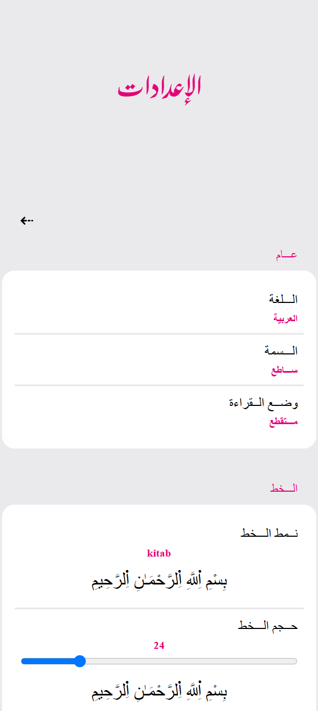
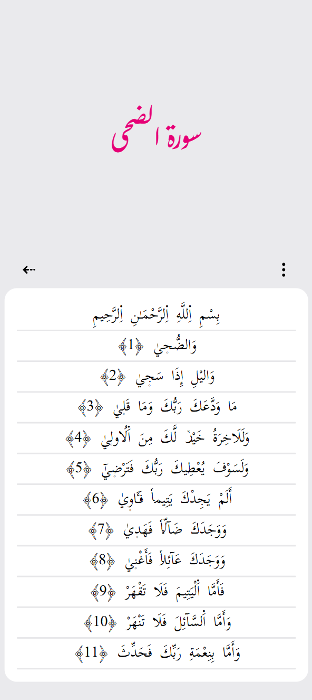
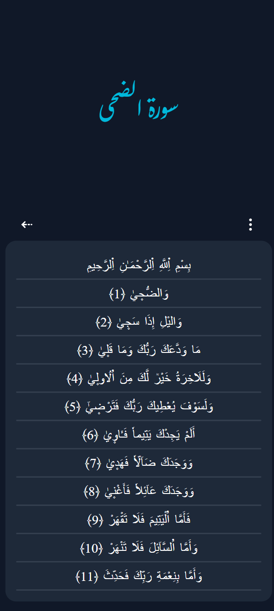

# **verses_web_app**

this project is about building a web application interface where the user is able to navigate and the quran.

## Dashboard

## Settings

## Bookmarks

## Light Theme

## Dark Theme

## Night Theme

