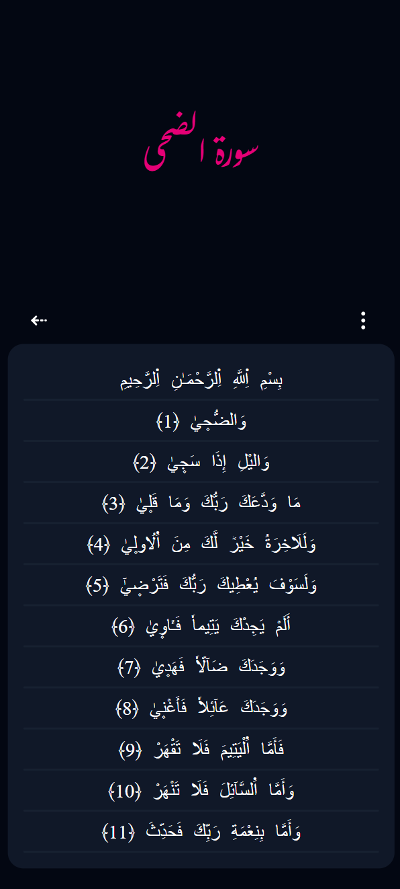

# **verses_web_app**

This project is an introduction into npm, react, typescript and tailwind, it is about building an SPA where the user is able to navigate and read the Quran.

## Description

-   This SPA provides the following Features:

    -   Browse by Hizb and Surah.
	-	Access to the 4 most recent readings.
	-	Persistent data.
	-	Search Page.
	-	Settings Page.
	-	Bookmarks Page.
    -   Tasbih page.
	-	About page.
    -   Font size, line height and inter words customization.
    -   Support for 8 different fonts.
    -   Support for 2 different reading modes: continuous, split.
    -   Support for 3 different themes: Light, Dark and Night.
    -   Support for 2 browsing languages: Arabic and English (Reading is just arabic).

-   This project is set up in a development environment built with docker, everything is manageable with a Makefile
-   `make` will build the image, install the dependencies, run the container and exec into the container.
-   `npm i && npm run dev` will the development server at port `7417`.
-	The application is built without a backend.
-	The project is set up with the `vite` build tool and uses react and typescript as base code, with `tailwindcss` for styling and `eslint` as a linter.
-	It uses `react-router-dom` for routing.
```
/
├── index → redirects to /surah
├── /
    ├── surah
    ├── hizb
    ├── counter
    ├── readhizb/:index
    ├── readsurah/:index
    ├── settings
    ├── bookmarks
    ├── search
    └── info
```
-	It also takes advantage of `useReducer` and `useContext` for state management, `localStorage` for persistent data, and `lodash` for data manipulation.

## New Concepts

-	Set up a fast React + TypeScript project using `Vite`.
-	Style the UI efficiently with Tailwind CSS.
-	Enforce code quality using ESLint.
-	Manage client-side routing with React Router DOM, including nested and dynamic routes.
-	Handle complex state with `useReducer` and share it globally using `useContext`.
-	Persist data locally using `LocalStorage`.
-	Utilize `lodash` for easier data manipulation.

## Dashboard


## Settings


## Bookmarks


## Light Theme


## Dark Theme



## Night Theme


